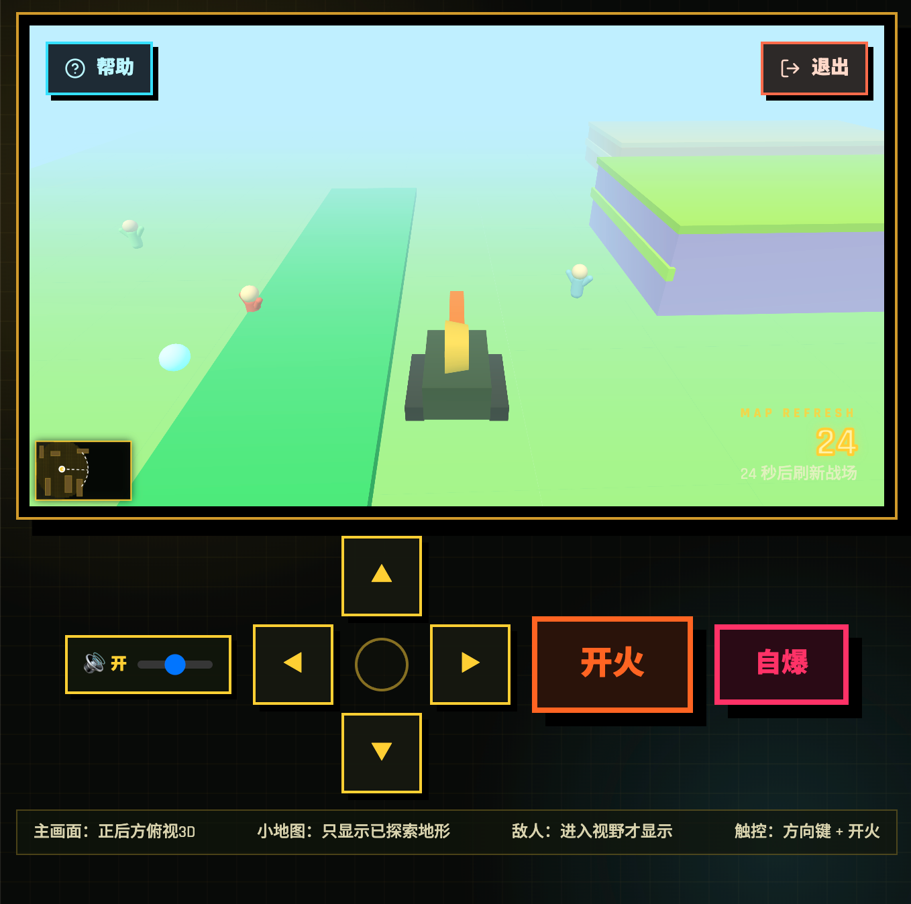
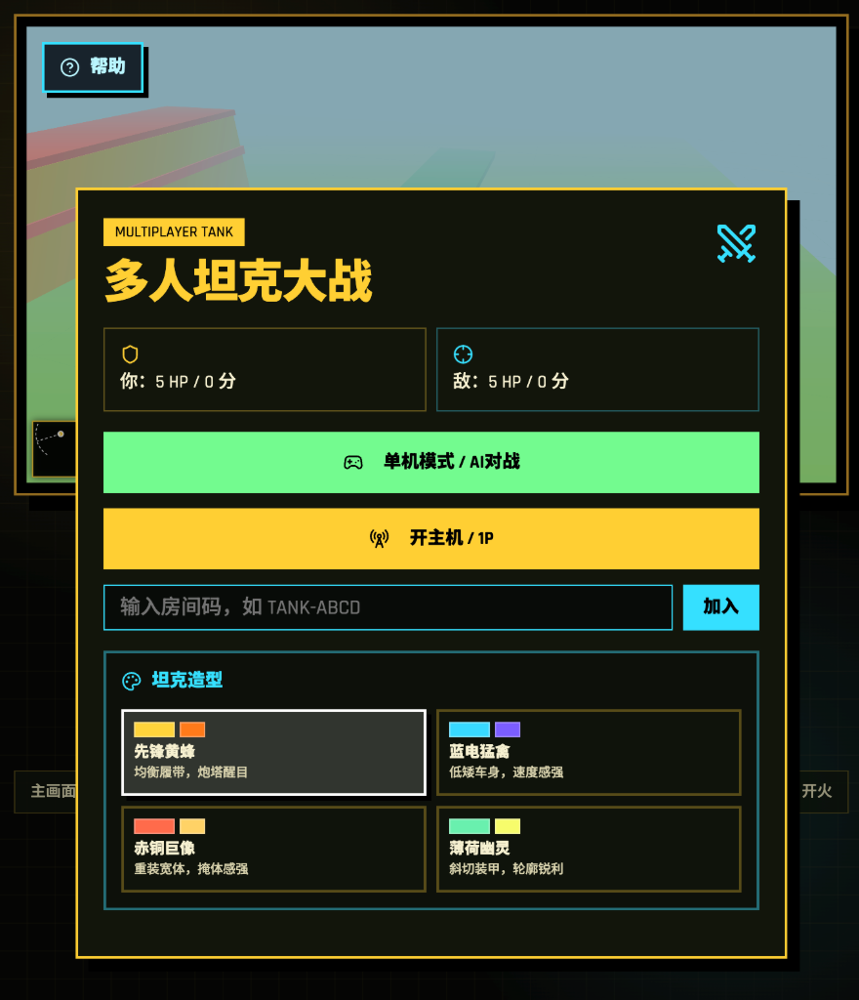

<div align="center">
  <h1>🎮 多人坦克大战 / Multiplayer Tank Battle</h1>
  <p>一款基于 Socket.IO 的最多 4 人联机坦克大战游戏</p>
  <p>A multiplayer tank battle game based on Socket.IO, supporting up to 4 players</p>
  
  <div align="center">
    <a href="https://tankbattle-kappa.vercel.app/" target="_blank"></a>
    <a href="https://github.com/xueduany/tankbattle/actions"></a>
    <a href="https://github.com/xueduany/tankbattle/blob/main/LICENSE"></a>
    <a href="https://github.com/xueduany/tankbattle"></a>
  </div>
  
  <p>🌐 <a href="https://tankbattle-kappa.vercel.app/" target="_blank">在线体验 / Play Online</a></p>
  
  <p>
    📖 <a href="#-部署指南--deployment-guide">部署指南</a> | 
    📄 <a href="./DEPLOYMENT.md">详细部署文档</a>
  </p>
</div>

---

## 📖 目录 / Table of Contents

- [游戏特性 / Features](#游戏特性--features)
- [安装运行 / Installation](#安装运行--installation)
- [游戏操作 / Controls](#游戏操作--controls)
- [技术栈 / Tech Stack](#技术栈--tech-stack)
- [项目结构 / Project Structure](#项目结构--project-structure)
- [开发说明 / Development](#开发说明--development)
- [部署指南 / Deployment Guide](#部署指南--deployment-guide)
- [许可证 / License](#许可证--license)

---

## ✨ 游戏特性 / Features

### 🎯 核心玩法 / Core Gameplay
- **多人对战**：支持最多 4 人联机对战
  - **Multiplayer Battle**: Supports up to 4 players online
- **战争迷雾**：视野系统，只有坦克周围区域可见
  - **Fog of War**: Vision system, only visible around your tank
- **河流系统**：坦克无法通过，但子弹可以穿越
  - **River System**: Tanks cannot pass, but bullets can
- **地图刷新**：战场会定期刷新，带来新的战术体验
  - **Map Refresh**: Battlefield refreshes periodically

### 🎨 视觉效果 / Visual Effects
- **3D 渲染**：基于 Three.js 的 3D 战场
  - **3D Rendering**: Three.js based 3D battlefield
- **经典风格**：复古像素风格的坦克设计
  - **Classic Style**: Retro pixel art tank design
- **动态特效**：子弹轨迹、爆炸效果、迷雾渐变
  - **Dynamic Effects**: Bullet trails, explosions, fog transitions
- **NPC 死亡特效**：倒地动画 + 血迹效果
  - **NPC Death Effects**: Falling animation + blood splatter
- **坦克爆炸特效**：死亡时零件飞散和爆炸效果
  - **Tank Explosion**: Flying debris and explosion effects on death

### 🔗 网络功能 / Network Features
- **Socket.IO 架构**：从 PeerJS 重构为 Socket.IO，更稳定可靠的客户端-服务器架构
  - **Socket.IO Architecture**: Refactored from PeerJS to Socket.IO for more stable client-server architecture
- **最多 4 人联机**：支持 1 主机 + 3 客机的多人对战
  - **Up to 4 Players**: Supports 1 host + 3 guests multiplayer battle
- **房间码匹配**：通过房间码快速匹配对手
  - **Room Code Matching**: Quick matchmaking via room codes
- **玩家列表**：主机端显示所有玩家的连接状态和坦克颜色
  - **Player List**: Host side shows all players' connection status and tank colors
- **高频同步**：优化的状态同步频率，减少延迟
  - **High Frequency Sync**: Optimized state sync frequency to reduce latency

### 📱 跨平台支持 / Cross-platform
- **桌面端**：支持键盘操作
  - **Desktop**: Keyboard controls
- **移动端**：支持触屏控制
  - **Mobile**: Touch controls
- **响应式设计**：自适应不同屏幕尺寸
  - **Responsive Design**: Adaptive to different screen sizes

### 🎵 音频系统 / Audio System
- **背景音乐**：经典游戏背景音乐，默认关闭，游戏开始时暂停，游戏结束后恢复播放
  - **Background Music**: Classic game background music, off by default, paused during gameplay, resumed after game ends
- **音乐开关**：主菜单右上角添加音乐开关按钮
  - **Music Toggle**: Added music toggle button in top right of main menu
- **NPC 死亡语音**：随机喊叫声（Fuck you! / Help me! / 等等），音量最大
  - **NPC Death Voices**: Random shouts (Fuck you! / Help me! / etc.), maximum volume
- **音量控制**：可调节音乐音量
  - **Volume Control**: Adjustable music volume

### 🎯 游戏机制 / Game Mechanics
- **路人 NPC**：战场上随机走动的路人，可被碾压或击杀
  - **Pedestrian NPCs**: Randomly walking civilians on battlefield
- **敌人位置提示**：超过10秒没看到敌人时小地图显示位置2秒
  - **Enemy Position Hint**: Shows enemy position for 2 seconds after 10s of no sight
- **撞击扣血**：坦克撞击也会造成伤害（带冷却）
  - **Collision Damage**: Tank collision also causes damage (with cooldown)
- **自爆按钮**：快速自杀查看爆炸特效，爆炸半径250范围内的NPC也会被炸死
  - **Suicide Button**: Quick suicide to see explosion effects, NPCs within 250 radius will also be killed

---

## 📦 安装运行 / Installation

### 环境要求 / Requirements
- Node.js >= 20.x
- pnpm >= 8.x

### 安装步骤 / Installation Steps

```bash
# 1. 克隆仓库 / Clone repository
git clone https://github.com/xueduany/tankbattle.git
cd tankbattle

# 2. 安装依赖 / Install dependencies
pnpm install

# 3. 运行开发服务器 / Run development server
pnpm dev
```

### 访问游戏 / Access Game

打开浏览器访问 `http://localhost:5173` 即可开始游戏！
Open browser and visit `http://localhost:5173` to start the game!

### 在线体验 / Online Demo

🌐 **https://tankbattle-kappa.vercel.app/**

### 命令列表 / Commands

| 命令 / Command | 说明 / Description |
|---------------|-------------------|
| `pnpm dev` | 启动开发服务器 / Start development server |
| `pnpm build` | 构建生产版本 / Build production version |
| `pnpm preview` | 预览构建结果 / Preview build result |
| `pnpm lint` | 代码检查 / Lint code |
| `pnpm server` | 启动 Socket.IO 服务器 / Start Socket.IO server |

---

## 🎮 游戏操作 / Controls

### 键盘操作 / Keyboard Controls
| 按键 / Key | 功能 / Action |
|-----------|--------------|
| ↑ / W | 向上移动 / Move Up |
| ↓ / S | 向下移动 / Move Down |
| ← / A | 向左移动 / Move Left |
| → / D | 向右移动 / Move Right |
| 空格 / Space | 开火 / Fire |

### 触屏操作 / Touch Controls
- **方向键区域**：点击方向按钮控制移动
  - **Direction Pad**: Tap to move
- **开火按钮**：点击右下角按钮发射子弹
  - **Fire Button**: Tap to shoot
- **自爆按钮**：点击粉色按钮立即自杀（查看特效）
  - **Suicide Button**: Tap pink button to suicide (see effects)
- **音量控制**：点击喇叭图标开关音乐
  - **Volume Control**: Tap speaker icon to toggle music

### 游戏模式 / Game Modes

#### 单机模式 / Single Player Mode
1. 点击「单机模式」按钮 / Click "Single Player" button
2. AI 控制敌方坦克自动对战 / AI controls enemy tank
3. 无需网络连接 / No network required

#### 联机模式 / Online Mode

**创建主机 / Create Host:**
1. 点击「开主机」按钮 / Click "Create Host" button
2. 等待对方加入 / Wait for opponent

**加入房间 / Join Room:**
1. 在输入框中输入房间码 / Enter room code
2. 点击「加入」按钮 / Click "Join" button

---

## 🛠️ 技术栈 / Tech Stack

| 技术 / Tech | 版本 / Version | 说明 / Description |
|------------|---------------|-------------------|
| React | 18.x | 前端框架 / Frontend framework |
| TypeScript | 5.x | 类型安全 / Type safety |
| Three.js | 0.x | 3D 渲染引擎 / 3D rendering engine |
| Socket.IO | 4.x | WebSocket 实时通信 / Real-time communication |
| TailwindCSS | 3.x | 样式框架 / CSS framework |
| Framer Motion | 11.x | 动画库 / Animation library |
| Vite | 6.x | 构建工具 / Build tool |
| Express.js | 4.x | 后端服务器 / Backend server |

---

## 📁 项目结构 / Project Structure

```
tankbattle/
├── public/                    # 静态资源 / Static assets
│   └── bgmusic.mp3           # 背景音乐 / Background music
├── src/
│   ├── components/           # UI 组件 / UI components
│   │   ├── ui/               # 基础 UI 组件 / Base UI components
│   │   └── ErrorBoundary.tsx # 错误边界 / Error boundary
│   ├── pages/
│   │   └── Home.tsx          # 主游戏页面 / Main game page
│   ├── contexts/             # React Context
│   ├── hooks/                # 自定义 Hooks / Custom hooks
│   ├── lib/                  # 工具函数 / Utility functions
│   ├── App.tsx               # 应用入口 / App entry
│   ├── main.tsx              # 主入口 / Main entry
│   └── index.css             # 全局样式 / Global styles
├── server.js                  # Socket.IO 服务器 / Socket.IO server
├── package.json              # 项目配置 / Project config
├── vite.config.ts            # Vite 配置 / Vite config
├── tsconfig.json             # TypeScript 配置 / TypeScript config
└── README.md                 # 项目说明 / Project README
```

---

## 🔧 开发说明 / Development

### Socket.IO 服务器 / Socket.IO Server

启动 Socket.IO 服务器：
Start Socket.IO server:

```bash
pnpm server
```

服务器将在 `http://localhost:3000` 启动，处理多人联机的房间管理和状态同步。
Server will start on `http://localhost:3000`, handling multiplayer room management and state sync.

### 自定义配置 / Customization

- **地图大小**：修改 `W` 和 `H` 常量 / Map size: Modify `W` and `H` constants
- **河流布局**：修改 `RIVERS` 数组 / River layout: Modify `RIVERS` array
- **视野范围**：修改 `REVEAL_RADIUS` 常量 / Vision range: Modify `REVEAL_RADIUS` constant

---

## 📷 游戏截图 / Screenshots

<div align="center">
  
  <p>图1：双人对战场景 / Fig 1: Dual Player Battle</p>
</div>

<div align="center">
  
  <p>图2：主菜单界面 / Fig 2: Main Menu</p>
</div>

---

## 📋 更新日志 / Changelog

### 最新更新 / Latest Updates
- **Socket.IO 架构重构**：从 PeerJS (P2P) 重构为 Socket.IO 客户端-服务器架构，更稳定可靠
  - **Socket.IO Architecture Refactor**: Refactored from PeerJS (P2P) to Socket.IO client-server architecture for better stability
- **最多 4 人联机**：支持 1 主机 + 3 客机的多人对战
  - **Up to 4 Players**: Supports 1 host + 3 guests multiplayer battle
- **玩家列表 UI**：主机端显示所有玩家的连接状态和坦克颜色，符合 Brutalist HUD 风格
  - **Player List UI**: Host side shows all players' connection status and tank colors, in Brutalist HUD style
- **音乐开关**：主菜单右上角添加音乐开关按钮，默认关闭音乐
  - **Music Toggle**: Added music toggle button in top right of main menu, music off by default
- **按键卡顿修复**：修复了 2P/3P 按键卡住的问题，客机持续发送输入状态
  - **Input Lag Fix**: Fixed 2P/3P input stuck issue, guests continuously send input state
- **高频状态同步**：提高状态同步频率，减少延迟，优化游戏体验
  - **High Frequency State Sync**: Increased state sync frequency, reduced latency, improved gameplay experience
- **React 闭包陷阱修复**：使用 useRef 解决 React 闭包陷阱问题，确保状态同步正确
  - **React Closure Trap Fix**: Used useRef to solve React closure trap issue, ensuring correct state sync
- **背景音乐控制**：游戏开始时暂停，游戏结束后恢复播放
  - **Background Music Control**: Paused during gameplay, resumed after game ends
- **NPC 系统**：添加了随机走动的路人 NPC，可被坦克碾压或子弹击杀
  - **NPC System**: Added randomly walking civilians that can be run over or shot
- **死亡特效**：坦克爆炸时零件飞散，NPC 倒地留血迹
  - **Death Effects**: Tank explosions with flying debris, NPCs fall with blood splatter
- **语音效果**：NPC 死亡时随机发出喊叫声（Fuck you! / Help me! / 等等），音量最大
  - **Voice Effects**: NPCs make random shouts when killed (Fuck you! / Help me! / etc.), maximum volume
- **敌人提示**：超过10秒没看到敌人时，小地图显示位置2秒
  - **Enemy Hint**: Shows enemy position for 2 seconds on minimap after 10s of no sight
- **河流优化**：减少河流数量从5条到2条，更合理的地图布局
  - **River Optimization**: Reduced rivers from 5 to 2 for better map layout
- **撞击伤害**：坦克撞击造成伤害（带冷却机制）
  - **Collision Damage**: Tank collision causes damage (with cooldown)
- **自爆按钮**：添加快速自杀功能，爆炸半径250范围内的NPC也会被炸死
  - **Suicide Button**: Quick suicide function, NPCs within 250 radius will also be killed
- **地图刷新**：地图刷新时 NPC 也重新生成
  - **Map Refresh**: NPCs respawn when map refreshes

---

## 🚀 部署指南 / Deployment Guide

### 快速概述 / Quick Overview

由于我们使用 Socket.IO 架构，需要分开部署：
- **前端**：可以部署到 Vercel
- **Socket.IO 服务器**：需要部署到其他平台（Render、Railway、Fly.io 等）

### 详细文档 / Detailed Documentation

查看完整的部署指南：[DEPLOYMENT.md](./DEPLOYMENT.md)

### 快速步骤 / Quick Steps

1. **部署 Socket.IO 服务器**（推荐使用 Render）
2. **配置环境变量**：在 Vercel 中设置 `VITE_SOCKET_SERVER_URL`
3. **部署前端**：推送到 GitHub，Vercel 自动部署

### 环境变量配置 / Environment Variables

在 Vercel 项目设置中添加：
```
VITE_SOCKET_SERVER_URL=https://your-socket-server.onrender.com
```

---

## 📜 许可证 / License

MIT License - 详见 [LICENSE](LICENSE)
MIT License - See [LICENSE](LICENSE) for details

---

## 🤝 贡献 / Contributing

欢迎提交 Issue 和 Pull Request！
Contributions are welcome! Feel free to submit issues and pull requests.

---

<div align="center">
  <p>🚀 享受游戏！ / Enjoy the game!</p>
</div>